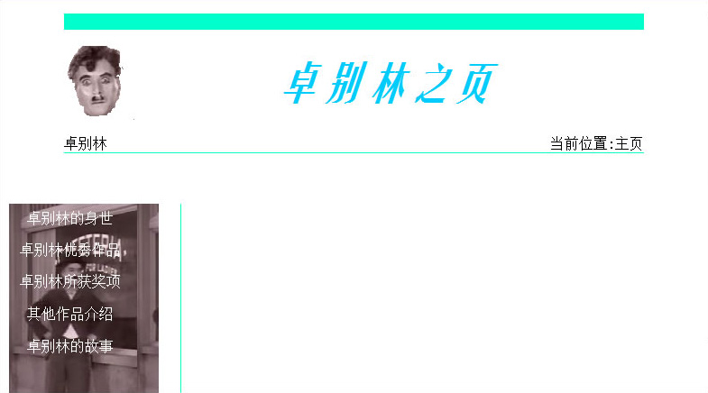

[卓别林之页>>](/site/02-study-Chaplin/index.html)

## 年代
约2002年

## 回顾
也是一个跟着教程练手的习作页面，主题来源是爸爸从老板那里借来的卓别林系列影片。

跟随教程的深入，这次的习作已经开始有 Logo、面包屑导航、左右栏布局的网页雏形。

卓别林的头像是用[网页三剑客](https://baike.baidu.com/item/%E7%BD%91%E9%A1%B5%E4%B8%89%E5%89%91%E5%AE%A2)其一的 Fireworks 扣的，用橡皮擦一点点擦，并且发现 png 图片是可以保存透明度信息的（后来知道是 alpha 通道）。那时候 Photoshop 中复杂的功能、陌生的术语，对我来说太难了，完全不知如何下手。

## 反思
我从看卓别林默剧、猫和老鼠动画片学到一个事实——**少即是多**。

- 虽然都没有对白，但能把故事说清楚；
- 没有电脑特效，但创意总令人眼前一亮；
- 故事不复杂，但尽显真善美；

它们在表现形式、创作手法是有诸多限制的。我处在创作中总有时候发现无论手上摄像机是 1080p 还是 4K分辨率，话筒是单声道还是立体声的，相比前二者创作条件已经是超豪华的了，仍会觉得不够用。对创作设备使用的消费化、娱乐化和人性贪婪本质，总会带偏我对讲述故事本身的关注度，转而不断倒腾创作工具。我敢说，像曾经我这样形式主义、本末倒置的人，大有人在，我也一直努力改善这一点。

在创作条件如此好的年代，引用 [FilmmakerIQ](https://www.youtube.com/channel/UCSFAYalJ2Q7Tm_WmLgetmeg) 频道常说的：

> We have some fantastic tools, so use them and make something great. 

动画片猫和老鼠除没有对白，画面也从未出现人类上半身。后来在制作[纪录片《自由的家猫》](https://awildpetcat.com)中也避免出现人物上半身，影片反而更加精炼，专注于主角的故事了。

## 题外话
继录像带后VCD成为了流行。爸爸买了一台带卡拉OK的三碟连放万利达VCD，可不得了了，邻居小朋友都到我家来看。

互联网不发达的年代，光盘是获取数据最方便的来源。很幸运借助这种媒介开阔了眼界，卓别林的经典默片就是其中之一，还有 Micheal Jackson 的 MTV、动画片猫和老鼠。那时看过的很多流行音乐、喜剧、动画放到今天仍不过时，**在这个充斥着肤浅感官刺激的快消费时代，反而这些经典更令我欣赏**。

卓别林的喜剧默片给我留下很深印象。在没有色彩、旁白录音、特效的情况下，能那样传神的讲述故事，让我佩服至极。更不用说在幽默的表象下那尖锐的讽刺，让人拍手称快，又生动体现大萧条、工业革命社会环境中的人情冷暖，令人笑中带泪。
