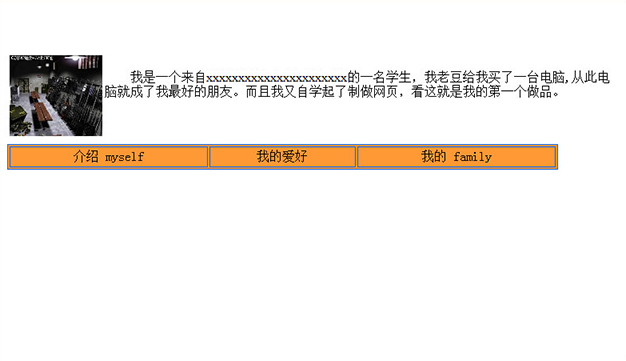

[个人主页习作>>](/museum/site/01-study/index.html)

## 年代
约2000年

## 回顾
一边看[网页三剑客](https://baike.baidu.com/item/%E7%BD%91%E9%A1%B5%E4%B8%89%E5%89%91%E5%AE%A2)的教程，一边动手的练习，连网页都算不上。教程是从电脑城买回来的光盘。

在那个人人都想当站长，欣欣向荣的“站长热”年代，拥有个人主页可是很时髦的。那时突然发现一种全新的方式来表达自己，会有各种好主意涌上心头，但受制于当时学习程度，没法表述出有内容有条理的内容来（现在还是不能）。

全局导航（如果算是的话）是当时典型的使用 Table 布局的做法。

页面上配图显然说明那时候 CS 正玩的疯，和同学放学后喊着“Fire in the hole”骑自行车追逐，回到家里和机器人对战几把可爽快了。

## 反思
- 配图用大分辨率文件，设置小尺寸样式后放上去，显然是无用的浪费。好在这页面之前从未上线过。
- 配图与主题毫无关联。**精心设计后的东西，没有元素是无缘无故出现在那里的**。从那开始我注意到“设计”的问题。
- Dreamweaver 所见即所得生成的代码非常冗余杂乱。作为入门还是非常合适，比当时微软的 Frontpage 好用多了，后来从 Macromedia 易主给 Adobe，还一度受到用户的反对。

## 题外话
很幸运在2000年那会接触到互联网，那时家里有台电脑就是件很了不得的事情了，“上网冲浪”更是奢侈。家庭上网要用 56K Modem（俗称“猫”）拨号，在移动互联网便利的当今，难以想象拨号上网的感觉。为加快网页加载速度，我会设置图片不自动加载，当今幸存的论坛里常有说法“图多杀猫”，就是从那个年代留存下来的。下载一个 4MB 的“大”文件，会在电脑前守上半个小时，等下完后立即下线。拨号上网是按秒计费的，生怕父母拿着长长的话费单来问我。甚至每次听到[上网拨号音](https://www.bilibili.com/video/av3631978/)，我都会心跳加速。

刚接触电脑，当然也是打着“查资料”的旗号玩各种游戏，好在我没有一直这样玩下去。那种醒悟，就是后来看到的说法“**不能总做一个消费者，要成为创造者**”。
