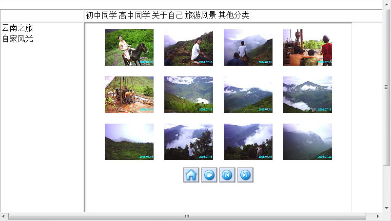

[相册 v1 >>](/museum/site/06-gallery-v1/website/index.html)

## 年代
约2006年9月

## 关于网站技术
此项目实现了网络相册的主要功能，但页面都未美化，仅由全局菜单、侧边菜单与图片主体三部分构成。参考动态服务器技术网站的设计，比如论坛程序、新闻管理系统等，将程序与内容数据分开。当时掌握动态页面技术对我是不可能的，况且网上可用的免费网页空间几乎只有静态空间。

我的设计是：客户端渲染 + JSONP。当然这是现在的归纳，那时候可不知道这些术语。现在觉得简单，当时可是费了好大劲儿才摸出这点东西来。页面由 js 脚本拼接渲染出 HTML，相册数据由 JSONP 方式获得。算得上我在系统设计方面的启蒙思考。

我设计的相册内容是一颗树的结构，节点是分类，叶子是一张照片。这样实践下来，之前学的数据结构派上了实际用场。

## 关于摄影
2004年闹着让爸妈花1100买了第一台数码相机，从那时开始接触摄影，街道、学校、同学杂七杂八，拍摄内容还算不上摄影作品，只是乐于记录身边各种事物。从此开始文曲星渐渐淡出我的生活，摄影将陪伴我走入下一个成长时期。为后来的钻研摄影和进入新闻行业埋下种子。

之前大伯有台 CASIO数码相机，每次能拍摄8张照片，连接电脑用打印机的并口（那时候 USB 是高端设备才有的接口），分辨率约为10万像素。我借来玩过几回，还有不少这相机拍摄的照片我至今留着。数码、电子产品对我就是有种莫名的吸引，就像是大孩子的玩具非要闹着买一台。

随着数码相机的普及，互联网内容也逐渐由纯文本走向多媒体，下一个网站项目[另类网](/museum/2007/02/26/offbeat/)也放了很多照片。
