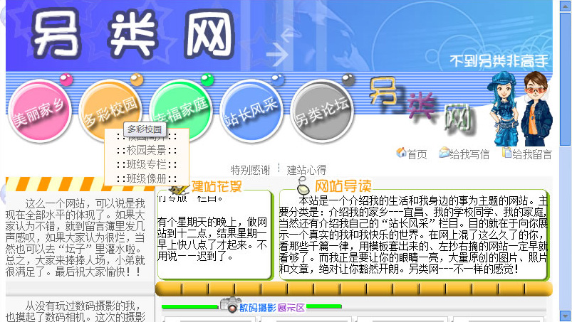

[另类网 >>](/museum/site/05-offbeat/index.html)

## 年代
约2007年2月

## 回顾
做此站是为参加市高中的一个什么第四届计算机作品比赛，当时获了三等奖。

从页面背景图来回顾，那时候正流行玩泡泡堂。顶部全局导航右侧的男生女生图是某个 QQ秀图片，页底部的绿山图是 GBA 游戏超级玛丽 rom 中抠的。本站设计同样模仿另外一个网站，大概是 wqxsky.net。

一些人生的道理在那时期逐渐形成，像“不到另类非高手”，这是“另类网”这个网站标题的来源，还有“没有做不到，只怕想不到”，在[人生信条](https://berlinchan.github.io/museum/site/05-offbeat/page/myself/motto.html)页面有记载。

我接触电脑、学习编程的经历，在页面[我的成长](https://berlinchan.github.io/museum/site/05-offbeat/page/myself/grow.html)有记载，从文字中再次感觉自己既是当今教育的受害者也是幸存者。页面最后一句话

> 我必将成为一名优秀的程序员

做完这网站后，我准备参加在华中科技大学举行的程序设计比赛，开始学习用 Pascal 语言描述的数据结构。纸上手写树的深度优先遍历，比听无聊的政治课有趣多了。比赛成绩不好，但对华中科技大学留下很好的印象，梦想考去华科学计算机，但无奈成绩没那么好。

## 反思

## 题外话
这次整理“审核”移除了很多涉及个人隐私的内容。在社交网络之前的年代，人们刚用上便利的网络，都敞开心胸的上网表达自己、结交朋友，如今除了像 Facebook, Google 这类靠用户隐私运行的企业外，还有很多暗处的 Big brother 在 watching you。计算机与网络便利了我们的生活，但总有人在其中做一些荒谬、愚蠢、邪恶的事情。
