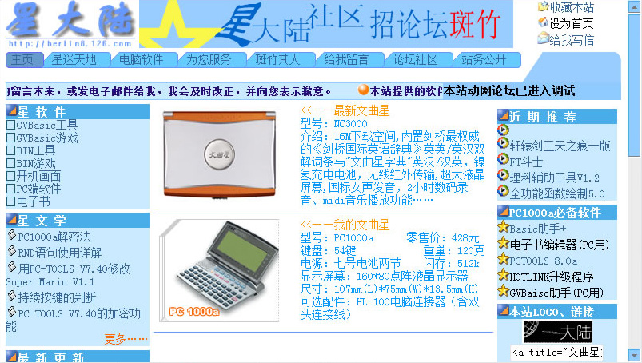

[星大陆 v3.0 >>](/site/04-starland-v3/index.html)

## 年代
约2004年3月

## 回顾
这版星大陆终于有实质内容了，包含精心收集整理的 PC1000a 程序与游戏（[站内可下载](https://museum.berlinchan.com/site/04-starland-v3/wqx/gvbtool/gvbtool.htm)），当年在星迷圈还有几个人知道。这版的界面是模仿一个免费资源网设计的。那时个人站长热，也催生了一堆免费网页空间服务商和免费资源推荐的网站。这版星大陆，当时存放在网易126的免费空间上，也是首个正式部署上线的网站。

发布后不久，有天在常逛的文曲星论坛上看到有帖子提到星大陆网站链接，有一种更强烈的归属与荣誉感，感觉自己是经历和建设这个社区的一份子，是一种难忘的愉悦。

一边整理，一边从尘封的记忆中搜寻熟悉的名字：Lee、郝新利、电脑蛙蛙等高手，还有兄弟网站。郝新利曾在论坛发过一系列讲解他制作的[GVBasic游戏“精灵岛”](https://museum.berlinchan.com/site/04-starland-v3/wqx/gvbgame/gvbgame.htm)的文章，我将他们都打印出来。用有趣的游戏制作内容，讲解设计与编程，反复阅读收获良多。

[《动物园历险记》](https://museum.berlinchan.com/site/04-starland-v3/wqx/gvbgame/soft/zoo-formal.htm)这个游戏我起码玩通3遍，[《风斗-人与自然》](https://museum.berlinchan.com/site/04-starland-v3/wqx/gvbgame/soft/winda.htm)[《欢乐潜水艇》](https://museum.berlinchan.com/site/04-starland-v3/wqx/gvbgame/soft/subp.htm)是上课时开小差最佳伙伴。在简陋的平台上开发运行如此精美的游戏，让我至今仍觉惊艳。GVBasic游戏除了玩之外，最大的乐趣就是可以随时打开代码来修改，我是这样爱上代码的。

## 反思
www.wqxnet.com 和 www.wqxsky.net 是我曾最爱上的两个论坛，在 BBS 成为各领域爱好者、专家聚集的平台初期，一片欣欣向荣的景象。想要钻研某个领域，泡论坛是最好的方式。从“河蟹”“实名制”这类词汇逐渐更多被提及后，这些交流平台的自由空间一直在缩小。

我研究当时流行的动网论坛 DV-BBS 源码时候，看到一份长长的关键词列表，第一次严肃注意到有“审查”这么一回事。

BBS 生在 Web2.0 这概念之前，动态服务器页面技术越来越为我们呈现个性化的内容，让互动讨论更加方便，技术革新之初的欣欣向荣，如今讨论氛围却大不如以前。

发生在 www.wqxnet.com 论坛争论导致的分化也让我为之伤心过，具体的事情经过已不记得，在[这里](http://wqx.lugede.cn/history.htm)有一些零星记载。有一次是说谁抄袭了谁的代码，一篇回帖“法律保护的是代码不是思想”让我难忘。

## 题外话
为这网站申请了126免费域名当永久域名，但事实证明，没有什么事情是“永久”的，从钟表被发明的那天起就不再有了。我的[博客站](https://www.berlinchan.com)从免费空间到 GoDaddy 到 BlueHost再到阿里云，不论收费免费都是各种无法访问，最后决定将所有内容静态化都搬到 GitHub，最简单的最靠谱。而且等我不在了没人续费，起码他不会给我删掉。

首页底部有个显示当前日期的 js，使用已弃用的方法 [getYear()](https://developer.mozilla.org/zh-CN/docs/Web/JavaScript/Reference/Global_Objects/Date/getYear)，让我想起尽人皆知但又不明所以的“千年虫”问题。

## 怀旧文曲星文章
- [文曲星记忆](http://wqx.lugede.cn/index.htm)
- [多少 80 后因为一台文曲星而走上了程序员之路 - ifanr.com](https://www.ifanr.com/1158241)
- [文曲星上有趣的事有哪些？ - zhihu.com](https://www.zhihu.com/question/23369076)

## Awesome 文曲星
- [《风斗》lava移植版](https://github.com/wangyu-/wind)
- [收集曾经的文曲星 lava 程序](https://github.com/sbhhbs/lava_collection)
- [文曲星内置GVBASIC模拟器](https://github.com/fancyblock/GVBASIC)
- [cross platform 文曲星](https://github.com/Wang-Yue/NC1020)
